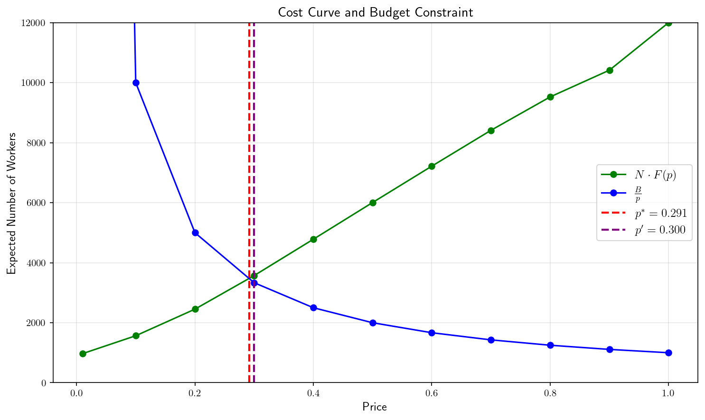
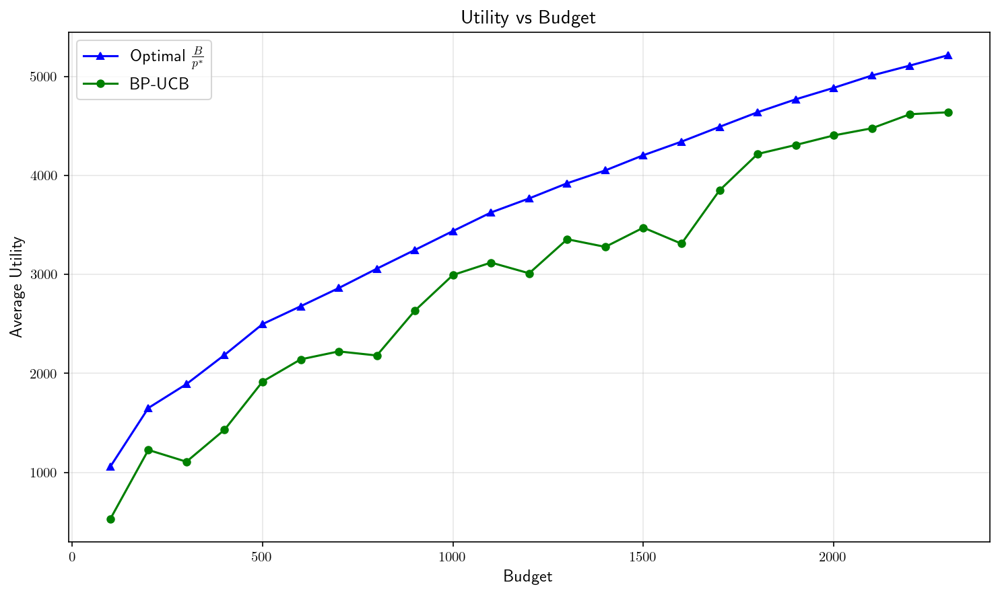
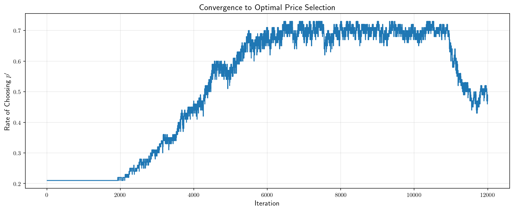
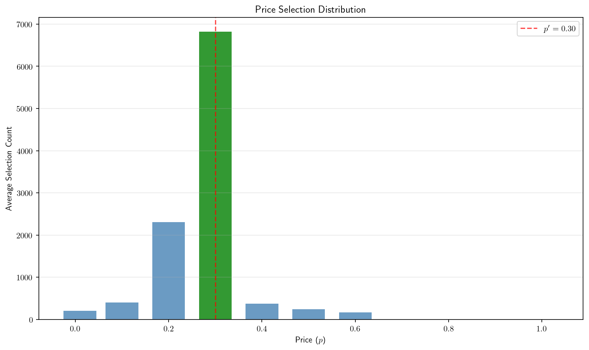
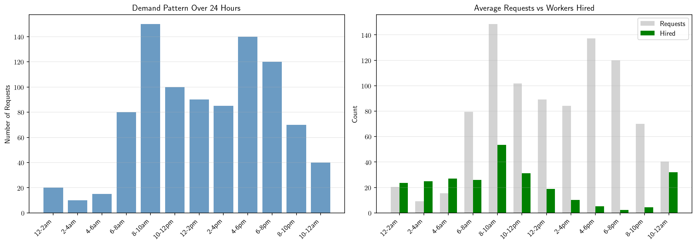

# Budget-Feasible Pricing with UCB Algorithms

Implementation of budget-feasible posted-price mechanisms using Upper Confidence Bound (UCB) algorithms for online learning. This project explores dynamic pricing strategies where a platform must hire workers (e.g., drivers) under budget constraints without knowing the distribution of worker costs.

## Problem Setting

A platform (requester) wants to hire workers to complete tasks:
- Workers have private costs $c_i$ drawn from an unknown distribution $F$
- The platform posts a price $p$ and workers accept if $p \geq c_i$
- The platform has a fixed budget $B$ and wants to maximize the number of hired workers
- The optimal price $p^*$ is where the curves $N \cdot F(p)$ and $\dfrac{B}{p}$ intersect

**Key metrics:**
- **Utility**: Number of workers hired
- **Optimal Utility**: $\dfrac{B}{p^{*}}$ (maximum achievable with perfect knowledge of $p^{*}$)
- **Efficiency**: $\dfrac{\text{Utility}}{\text{Optimal Utility}}$
- **Regret**: Optimal Utility $-$ Utility



## Algorithms

### BP-UCB (Budget-Feasible Posted-Price UCB)

The main algorithm discretizes the price space into $K$ arms and uses UCB to learn the optimal price:
- Maintains UCB estimates of acceptance probabilities: $\tilde{F}\left(p_i\right) = F_i + \sqrt{\dfrac{2 \ln t}{N_i}}$
- Selects prices that maximize $\min\left(N \cdot \tilde{F}\left(p_i\right), \dfrac{B}{p_i}\right)$
- Achieves sublinear regret compared to the optimal fixed price

### Dynamic BP-UCB

Extension for time-varying demand across different time periods (e.g., 2-hour slices for bike-sharing or ride-sharing), based on the real-world deployment described in Singla et al. (2015).

## Results

The BP-UCB algorithm achieves near-optimal performance:

| Budget | BP-UCB Utility | Optimal Utility | Efficiency |
|--------|----------------|-----------------|------------|
| 1000   | ~3070          | ~3437           | 89%        |
| 1500   | ~3488          | ~4198           | 83%        |
| 1900   | ~4495          | ~4771           | 94%        |

<table>
<tr>
<td width="50%">

**Utility vs Budget**

The algorithm tracks close to optimal utility across budget levels.



</td>
<td width="50%">

**Regret Analysis**

Average regret decreases relative to budget size (no-regret property).


</td>
</tr>
<tr>
<td width="50%">

**Convergence to Optimal Price**

Rate of selecting the optimal price increases over iterations.



</td>
<td width="50%">

**Price Selection Distribution**

The algorithm learns to focus on the optimal price $p'$ (green).



</td>
</tr>
</table>

### Dynamic BP-UCB

For time-varying demand scenarios (e.g., bike-sharing with morning/evening rush hours), Dynamic BP-UCB allocates budget across 12 two-hour time slices:

| Metric | Value |
|--------|-------|
| Total Budget | $100 |
| Avg Requests | ~916 |
| Avg Workers Hired | ~259 |
| Hire Rate | ~28% |



## Installation

```bash
# Clone the repository
git clone https://github.com/yourusername/ucb-pricing.git
cd ucb-pricing

# Install dependencies with uv
uv sync

# Or with pip
pip install -e .
```

## Usage

### As a Library

```python
from ucb_pricing import BPUCB
import numpy as np

# Initialize the algorithm
bp = BPUCB(
    budget=1000,
    n_workers=12000,
    c_min=0.0,
    c_max=1.0,
    n_prices=11
)
bp.prices[0] = 0.01  # Avoid zero price

# Generate or set worker bids
bids = np.random.uniform(0.1, 0.9, 12000)
bp.set_bids(bids)

# Run the algorithm
result = bp.run()
print(f"Utility: {result.utility}")
print(f"Optimal price p*: {bp.p_star:.4f}")
print(f"Regret: {bp.compute_regret(result):.0f}")
```

### Notebooks

Interactive demonstrations are available in the `notebooks/` directory:
- `01_bp_ucb.ipynb` - Basic BP-UCB implementation and analysis
- `02_dynamic_bp_ucb.ipynb` - Time-varying demand extension

```bash
uv run jupyter lab notebooks/
```

## Project Structure

```
ucb-pricing/
├── src/ucb_pricing/       # Core algorithm implementations
│   ├── bp_ucb.py          # Budget-Feasible Posted-Price UCB
│   └── dynamic_bp_ucb.py  # Dynamic version with time slices
├── notebooks/             # Interactive demos and experiments
└── assets/                # Visualizations and figures
```

## References

- Singla, A., and Krause, A. (2013). Truthful Incentives in Crowdsourcing Tasks using Regret Minimization Mechanisms. WWW '13.
- Singla, A., Santoni, M., Bartok, G., Mukerji, P., Meenen, M., and Krause, A. (2015). Incentivizing Users for Balancing Bike Sharing Systems. AAAI '15.
